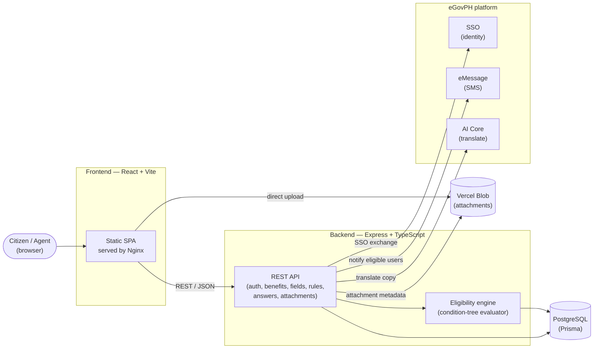

# Juan Claimed

**Every Filipino has government benefits they qualify for but never claim — because no single place tells them which ones, or what they still need to do.** Juan Claimed is a citizen-facing benefits matcher: answer a short, adaptive quiz once, and it tells you exactly which government programs you're eligible for, which ones are still pending on a missing answer, and lets you apply — all backed by an admin-configurable eligibility rule engine and integrated with the eGovPH platform for identity, notifications, and translation.

> Built for the [DTI x eGovPH Hackathon]. See [`docs/ARCHITECTURE.md`](docs/ARCHITECTURE.md) for the full system design, data flow diagrams, and eGov API integration details.

---

## The problem

Government benefit programs in the Philippines are scattered across agencies (DTI, DOH, DSWD, LGUs...), each with its own eligibility criteria, forms, and application process. A citizen has no single place to discover *"what am I actually entitled to?"* — so uptake stays low even for programs with real budget behind them, simply because eligibility is opaque and nobody wants to fill out ten different forms to find out.

## What Juan Claimed does

- **One quiz, many benefits.** A citizen answers general-purpose questions once (age, business ownership, residency, income, ...). Every active benefit program is evaluated against those same answers in real time.
- **Live eligibility status per benefit** — `MATCHED` (you qualify), `PENDING` (still missing an answer that could change the outcome), or `NOT_ELIGIBLE` (a condition already fails) — never a dead end, always the next concrete question to answer.
- **"Answer More"** resurfaces only the specific follow-up questions that could unlock a still-`PENDING` benefit, instead of re-asking the whole quiz.
- **No account required to explore.** A guest can run the full eligibility quiz anonymously (answers live in the browser only); creating an account (or eGovPH / Google sign-in) is only needed to actually apply and persist answers.
- **Admin-configurable, not hardcoded.** Government agents build benefit programs themselves — no code changes — by composing eligibility rules out of a visual condition tree (`ALL`/`ANY` groups of leaf conditions over any field, including nested hierarchies like PSGC location or business-sector taxonomies).
- **Role- and jurisdiction-scoped administration.** A `SUPERADMIN` manages the whole catalog; `AGENT`s are scoped to a `DimScope`/`DimGroup` (e.g. a specific city or a national agency) and only manage benefits and applicants within that jurisdiction.
- **eGovPH-native.** Sign in with your eGovPH identity, get an SMS the moment a new benefit you qualify for goes live, and author bilingual (English/Tagalog) content with one-click AI translation — all through eGovPH's own APIs, not a third-party stand-in.

## Live demo

A live worked example — the **DTI Negosyo Grant** — is documented end-to-end (rule tree, test personas, expected outcomes) in [`backend/docs/demo-benefit-dti-negosyo-grant.md`](backend/docs/demo-benefit-dti-negosyo-grant.md).

---

## Key features

| Area | What it does |
|---|---|
| **Eligibility engine** | Backend-evaluated condition trees (`ALL`/`ANY`, arbitrary nesting) per benefit; short-circuiting so a disqualified branch never nags for more answers; a PSGC-based residency scope check baked in as a first-class condition type. |
| **Dynamic field system** | Admin-defined fields (`TEXT`, `NUMBER`, `MONEY`, `DATE`, `BOOLEAN`, `SINGLE_SELECT`, `MULTI_SELECT`, `HIERARCHY_SELECT`, `DURATION`, `REPEATER_GROUP`) with per-field validation config, anchoring (show this field only after that one's answered), and reusable hierarchies (e.g. PH administrative divisions, business sectors). |
| **Guest + account flows** | Same quiz experience signed-out (localStorage-only) or signed-in (server-persisted); sign in with **Google** or **eGovPH SSO**, or a username/password staff account. |
| **Benefit lifecycle** | Requirements, "how to apply" steps, file attachments, utilization tracking, and bundling related benefits together — all admin-managed. |
| **Notifications** | Fire-and-forget SMS via eGov **eMessage** to every already-eligible user the moment a new matching benefit is published. |
| **Auto-translate** | One click to draft the Tagalog counterpart of any English field/benefit copy via eGov **AI Core**. |
| **File uploads** | Direct-to-storage attachment uploads (Vercel Blob) — file bytes never transit the backend. |
| **Role-based admin console** | Manage benefits, fields, rule groups, agents/staff, groups/scopes, and the full user roster from a dedicated admin UI. |

---

## Tech stack

| Layer | Technology |
|---|---|
| Frontend | React 19, TypeScript, Vite, Tailwind CSS, Radix UI, React Router |
| Backend | Node.js (Express 5, TypeScript, ESM), Zod validation |
| Database | PostgreSQL, Prisma ORM (driver adapters) |
| Auth | JWT, Google Identity Services, eGovPH SSO |
| File storage | Vercel Blob |
| eGov integrations | SSO, eMessage (SMS), AI Core (translation) — see [integration points](docs/ARCHITECTURE.md#egov-api-integration-points) |
| Infra | Docker, self-hosted container registry, GitHub Actions CI/CD, Nginx reverse proxy on a VPS |

---

## Architecture at a glance



Full system diagrams (auth sequence, eligibility evaluation flow, data model, and the CI/CD → VPS deployment pipeline) live in **[`docs/ARCHITECTURE.md`](docs/ARCHITECTURE.md)**. For the same six diagrams as a standalone illustrated page, open [`docs/architecture.html`](docs/architecture.html) directly in a browser (GitHub shows it as source, not rendered — download or clone first).

---

## Getting started (local dev)

`docker-compose.yml` is the **local development** stack — hot-reloading source, an empty
throwaway Postgres volume, self-bootstrapping on first run. It is the only compose file you
need to touch to run this project on your machine. (`docker-compose.staging.yml` and
`docker-compose.prod.yml` run prebuilt images on the actual VPS via CI/CD — see
[Deployment](#deployment) — you don't need either one locally, they're mentioned only so
you know the path from "runs on my machine" to "runs in production" is already real.)

### Prerequisites

- Docker Desktop (only requirement — no local Node/Postgres install needed)

### 1. Clone and configure

```bash
git clone <repo-url>
cd juan-claimed-v2
cp .env.example .env          # repo-root .env — see "Environment variables" below
cp backend/.env.example backend/.env
```

At minimum, set `JWT_SECRET` in both files to any non-empty string. Google/eGovPH sign-in,
SMS, translation, and attachment uploads each degrade gracefully (that one feature is
disabled with a clear error) if their specific env vars are left blank — nothing else breaks.

### 2. Start the stack

```bash
docker compose up -d --build
```

| Service | Port | URL |
| --- | --- | --- |
| frontend | 5175 | http://localhost:5175 |
| backend | 4000 | http://localhost:4000 |
| Prisma Studio (on demand, see below) | 5555 | http://localhost:5555 |
| postgres | 5432 | localhost:5432 |

That's the whole setup — **no manual migration or seed step**. On first boot, the backend
container starts against a genuinely empty Postgres volume and automatically:

1. runs `prisma generate`,
2. applies every migration in `backend/prisma/migrations` via `prisma migrate deploy`,
3. seeds reference data + staff accounts (`superadmin`, scoped agents — password
   `password123` for all) and, with `SEED_DEMO_PERSONAS=true` (the local default), a
   handful of ready-to-use citizen demo accounts too — **only if the database is still
   empty**, so restarting an already-seeded container is a safe no-op instead of erroring
   or duplicating data.

See it happen live:

```bash
docker compose logs -f backend
```

### 3. Verify

```bash
curl http://localhost:4000/health
```

Open http://localhost:5175 and sign in as `superadmin` / `password123` to see the admin
console, or explore the quiz as a guest straight away.

### Daily use

```bash
docker compose up -d                # start everything
docker compose logs -f backend      # tail backend logs
docker compose down                 # stop everything (keeps db data)
docker compose down -v              # stop + wipe the db volume (next boot reseeds from empty)
docker compose up -d --build        # rebuild after dependency/Dockerfile changes
```

Source is bind-mounted — edit files locally and both `tsx watch` (backend) and Vite (frontend) hot-reload automatically; no rebuild needed for ordinary code changes.

Need to poke at data directly?

```bash
docker compose exec -d backend npx prisma studio --port 5555 --browser none
```

Then open http://localhost:5555 yourself (`-d` runs it detached, `--browser none` avoids a crash since Studio tries to auto-open a browser inside the container).

---

## Environment variables

Two `.env` files are involved:

- **Repo-root `.env`** — read by `docker-compose.yml` and interpolated into the containers (secrets, third-party client IDs). Copy from `.env.example`. `DATABASE_URL`/`BACKEND_PORT` aren't part of it — the dev compose file hardcodes those two for you (host `postgres`, port `4000`), nothing to configure.
- **`backend/.env`** — read directly by Prisma CLI commands and any tooling run outside Docker (e.g. `npx prisma studio`). Copy from `backend/.env.example`.

| Variable | Required? | Purpose |
|---|---|---|
| `JWT_SECRET` | Yes | Signs/verifies API auth tokens |
| `GOOGLE_CLIENT_ID` | Optional | Google sign-in |
| `EGOV_BASE_URL`, `EGOV_PARTNER_CODE`, `EGOV_PARTNER_SECRET` | Optional | eGovPH SSO sign-in |
| `EGOV_MESSAGE_BASE_URL`, `EGOV_EMESSAGE_ACCESS_TOKEN` | Optional | eGov eMessage SMS notifications |
| `EGOV_AI_CORE_BASE_URL`, `EGOV_AI_ACCESS_CODE` | Optional | eGov AI Core auto-translate |
| `BLOB_READ_WRITE_TOKEN` | Optional | Vercel Blob attachment uploads |
| `SEED_DEMO_PERSONAS` | Optional | Seed demo citizen accounts (local/dev only, defaults `true`) |

Every var and exactly which route needs it is documented inline in `backend/.env.example` and cross-referenced per-endpoint in [`backend/routes.md`](backend/routes.md).

---

## Project structure

```
juan-claimed-v2/
├── backend/                 Express + TypeScript API
│   ├── src/
│   │   ├── routes/          URL → controller mapping
│   │   ├── controllers/     req/res only, no business logic
│   │   ├── services/        business logic + Prisma calls (eligibility engine, eGov clients, ...)
│   │   ├── requests/        Zod input-validation schemas
│   │   ├── middlewares/     auth, error handling
│   │   └── tests/           API integration tests
│   ├── prisma/               schema, migrations, seeders, one-off scripts
│   ├── docs/                 API reference + demo-benefit walkthroughs
│   └── routes.md             full endpoint-by-endpoint reference
├── frontend/                 React + Vite SPA
│   └── src/
│       ├── pages/public/     citizen-facing quiz, benefits, profile
│       ├── pages/admin/      benefit/field/rule/agent/group management
│       └── components/       shared field renderers, form engine, UI kit
├── deploy/                   VPS/Nginx/registry provisioning notes
├── docker-compose.yml         local dev stack
├── docker-compose.staging.yml staging stack (prebuilt images, no bind mounts)
├── docker-compose.prod.yml    production stack (prebuilt images, no bind mounts)
└── docs/
    └── ARCHITECTURE.md        system design, diagrams, eGov integration points
```

---

## API reference

- [`backend/routes.md`](backend/routes.md) — every endpoint, auth requirement, request/response shape, and eGov flow explained end to end.
- [`backend/docs/api-docs.md`](backend/docs/api-docs.md) — Fields domain deep dive (condition operators, hierarchy shapes).
- [`backend/docs/condition-value-shapes.md`](backend/docs/condition-value-shapes.md) — exact value shapes the eligibility engine expects per field type.

## Testing

```bash
docker compose exec backend npm test
```

Integration tests cover auth, benefits, fields, rule groups, and the eligibility engine against a real database.

## Deployment

Production runs as prebuilt Docker images on a VPS, built and pushed automatically by GitHub Actions on every push to `staging`/`main`, behind an Nginx reverse proxy. See [`docs/ARCHITECTURE.md`](docs/ARCHITECTURE.md#deployment--cicd) for the full pipeline diagram — `docker-compose.prod.yml`/`docker-compose.staging.yml` are the source of truth for what actually runs.

## Troubleshooting

- **Port already in use** — another process holds 5175/4000/5432/5555; stop it or remap the port in `docker-compose.yml`.
- **Prisma client not found** — regenerates automatically on container start; if it's still missing, run `docker compose exec backend npx prisma generate`.
- **Reset the database completely** — `docker compose down -v` (deletes the Postgres volume) then `docker compose up -d --build`; the backend detects the empty database and re-migrates + reseeds automatically, nothing manual to run.
