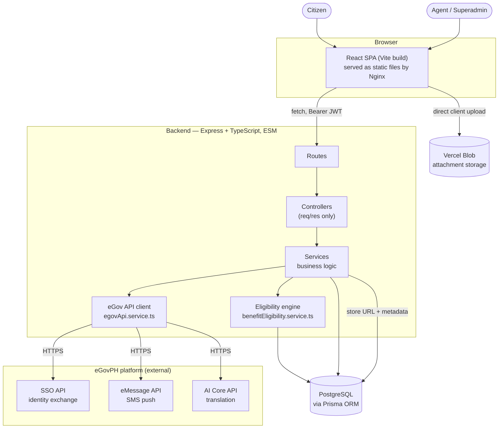
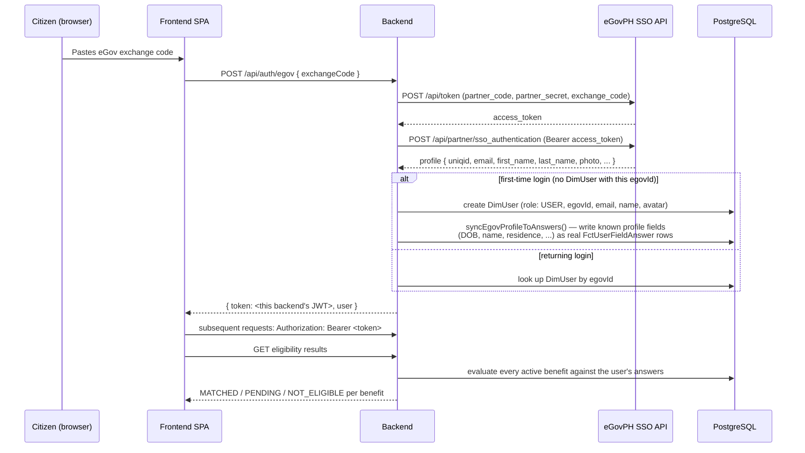
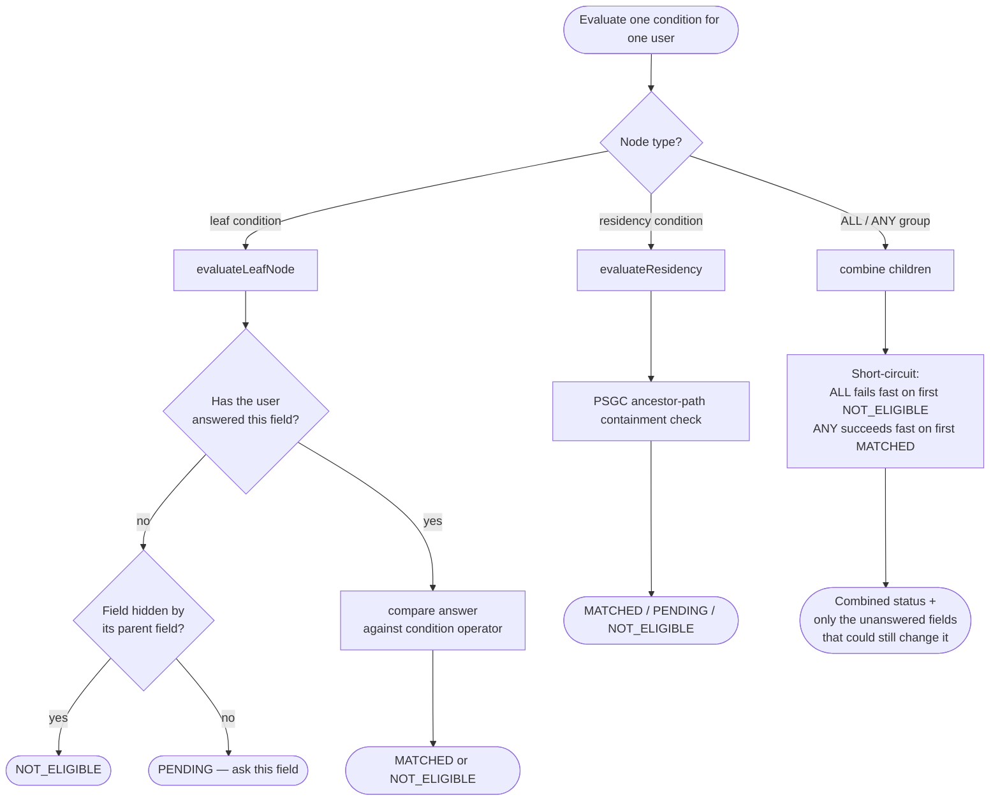
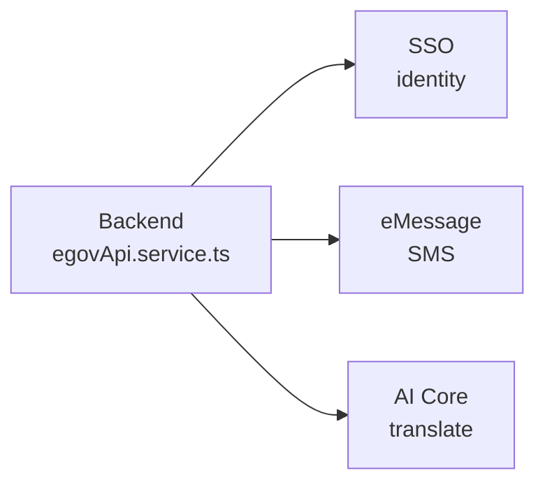
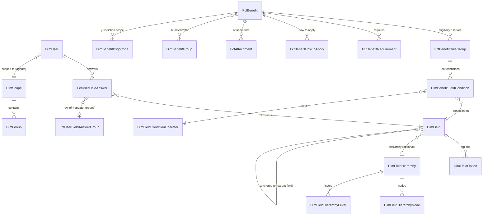
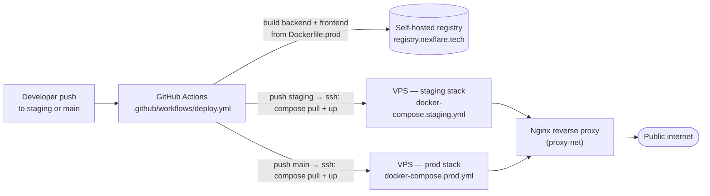

# System Architecture

This document is the technical deep dive behind [`README.md`](../README.md): how the system
is put together, how a request flows through it, how the eligibility engine actually
decides who qualifies for what, and how eGovPH's APIs are integrated. It assumes the
reader already knows *what* Juan Claimed does — see the README for that.

## Contents

- [System overview](#system-overview)
- [Request flow: signing in with eGovPH](#request-flow-signing-in-with-egovph)
- [The eligibility engine](#the-eligibility-engine)
- [eGov API integration points](#egov-api-integration-points)
- [Data model](#data-model)
- [Access control](#access-control)
- [Deployment & CI/CD](#deployment--cicd)

---

## System overview

**Frontend** — a single React SPA. Public/citizen routes (`/`, the quiz, benefit details,
profile) and admin routes (`/admin/...`) live in the same app, gated by role, built once by
Vite and served as static files by Nginx in production.

**Backend** — a single Express app (`backend/src/app.ts`) with no `.listen()` of its own;
`src/index.ts` is the local/Docker entrypoint that boots it. Layering is strict and one-way:
`routes/` → `controllers/` (no business logic) → `services/` (business logic + all Prisma
calls). `requests/` holds Zod schemas validated at the controller boundary;
`middlewares/` holds auth and centralized error handling.

**Database** — one PostgreSQL instance, accessed exclusively through a single shared Prisma
Client instance (`backend/src/utils/prisma.ts`) — services never instantiate their own
client, which would exhaust connections under load.

**eGovPH platform** — three product APIs are actually wired into services today: **SSO**
(identity), **eMessage** (SMS), **AI Core** (translation). See
[eGov API integration points](#egov-api-integration-points) below for the full picture,
including the APIs whose credentials are already provisioned for a next integration pass.

---

## Request flow: signing in with eGovPH

The eGovPH SSO exchange is the integration most worth walking through end to end, since it
touches identity, the field-answer system, and the eligibility engine in one flow.

The token returned to the frontend is **this backend's own JWT** (signed with
`JWT_SECRET`), not eGov's token — eGov's `access_token` is single-use, scoped to that one
profile fetch. Fields eGov already knows about the citizen (date of birth, residence, ...)
are written straight into `FctUserFieldAnswer` on first login via
`egovAnswerSync.service.ts`, so the quiz never re-asks something eGov already told us —
those specific fields are then locked in the UI (see `lib/egov-field-lock.ts`) so a synced
answer can't silently drift from the citizen's actual eGov identity.

Google sign-in (`POST /api/auth/google`) follows the identical shape — verify a third-party
token, upsert a `DimUser`, issue our own JWT — but does **not** run the eGov profile sync,
since Google doesn't carry PH-government-specific identity fields.

---

## The eligibility engine

`backend/src/services/benefitEligibility.service.ts` is the core of the product: given a
benefit's admin-authored condition tree and a user's current answers, it decides whether
that benefit is `MATCHED`, `PENDING`, or `NOT_ELIGIBLE` — and, critically, exactly *which*
unanswered field would move the needle.

That per-condition evaluation repeats for **every** leaf in the benefit's rule tree — a
benefit is `MATCHED` only once every condition in it comes back `MATCHED`; one `NOT_ELIGIBLE`
anywhere in an `ALL` group is enough to fail the whole benefit outright, regardless of
what the other conditions say.

Two design decisions worth calling out:

- **Short-circuiting drives "Answer More".** Once one branch of an `ALL` group is already
  `NOT_ELIGIBLE`, the engine never asks for the rest of that branch's fields — a benefit
  you've already failed never nags for more answers that can't change the outcome.
  `computeSettledHiddenFieldIds` determines which fields are *definitively* hidden by an
  already-decided sibling condition, which is what lets a never-answered field still
  correctly resolve to `NOT_ELIGIBLE` (not `PENDING`) when it's behind a closed gate.
- **Residency is a first-class condition type**, not a generic field comparison — it walks
  a citizen's PSGC ancestor path (barangay → city → province → region) against a benefit's
  configured jurisdiction scope, so "this benefit is Cavite-only" and "this benefit is
  national" are expressed the same way an agent's own scope is.

The same evaluator backs both the authenticated flow
(`evaluateBenefitEligibilityWith`/`evaluateBenefitEligibilityDetailById`) and the guest flow
(`evaluateBenefitEligibilityForAnswersWith`/`evaluateBenefitEligibilityDetailForAnswers`,
fed with in-browser answers instead of a stored `DimUser`) — a guest gets the exact same
decision logic as a signed-in citizen, just without persistence.

---

## eGov API integration points

The backend integrates three eGovPH product APIs, each wired into a working feature:

| eGov product | Where | What it does |
|---|---|---|
| **SSO** | `egovApi.service.ts` (`mintAccessToken`, `fetchProfile`) → `auth.service.ts` → `egovAnswerSync.service.ts` | `POST /api/auth/egov` — exchange-code login, profile fetch, first-login field sync |
| **eMessage** | `egovApi.service.ts` (`sendSms`) → `benefitNotification.service.ts` | Fire-and-forget SMS to every already-eligible user (has a `Mobile Number` answer, role `USER`) the moment a new benefit is published |
| **AI Core** | `egovApi.service.ts` (`mintAiCoreAccessToken`, `translateText`) → `translate.routes.ts` | `POST /api/translate` — one-click English→Tagalog draft while authoring a benefit/field |

All three implemented integrations fail closed and silently — a failed API request is
logged, never crashes the request that triggered it.

---

## Data model

Simplified to the entities that carry the actual product logic — the full schema
(`backend/prisma/schema.prisma`) also has supporting dimension tables (countries, schools,
field option lists, etc.) omitted here for readability.

- **`FctBenefit`** is the root of a benefit program: its eligibility is one
  `FctBenefitRuleGroup` tree of `ALL`/`ANY` groups bottoming out in
  `DimBenefitFieldCondition` leaves, each pairing a `DimField` with a
  `DimFieldConditionOperator` and expected value(s).
- **`DimField`** is the reusable question catalog — one field (e.g. "Number of Employees")
  can be referenced by many benefits' rule trees, and fields can **anchor** to one another
  (a follow-up field only renders once its parent is answered a specific way).
- **`DimFieldHierarchy`** backs any tree-shaped field (PSGC administrative divisions,
  business-sector taxonomies, ...) — `HIERARCHY_SELECT` fields store the selected leaf
  node's `value`; the engine resolves the full ancestor path at evaluation time when a
  condition needs to match on an ancestor rather than the exact leaf.
- **`FctUserFieldAnswer`** is the single source of truth for what a citizen has told the
  system — one row per `(user, field)`, or per `(user, field, repeaterGroup)` for
  repeatable sub-forms via `FctUserFieldAnswerGroup`.

---

## Access control

Three roles, enforced server-side on every protected route via the auth middleware
(`backend/routes.md` has the exact precedence rules):

| Role | Scope | Can do |
|---|---|---|
| `USER` | Self only | Answer the quiz, view own eligibility, apply, manage own profile |
| `AGENT` | Their `DimScope`/`DimGroup` (e.g. one LGU, or one national agency) | Manage benefits, fields, and view applicants within their jurisdiction |
| `SUPERADMIN` | Everything | Full catalog + user/agent management, no jurisdiction restriction |

A signed-out **guest** gets the full eligibility quiz with zero server-side footprint —
answers live only in `localStorage` — so exploring "what am I eligible for" never requires
creating an account; only applying does.

---

## Deployment & CI/CD

- Every push to `staging` or `main` builds **both** images (`Dockerfile.prod` for each of
  `backend/` and `frontend/`) and pushes two tags: a floating `latest`/`staging` tag and an
  immutable `<branch>-<timestamp>-<short-sha>` tag for rollback.
- The frontend's `VITE_*` vars are baked in at **build** time (Vite inlines them into the
  static bundle) via `--build-arg` in the workflow — changing one means a rebuild, not an
  env var edit on the VPS.
- The two production-shaped compose files (`docker-compose.staging.yml`,
  `docker-compose.prod.yml`) never build from source and never bind-mount it — they only
  `pull` prebuilt images, so a VPS deploy is just "pull the new tag, restart the container,"
  no git checkout or build step on the server itself.
- Postgres and Prisma Studio are never exposed publicly in either stack; the backend and
  frontend containers have no published host ports at all — Nginx reaches them over a
  shared Docker network (`proxy-net`) by container name.

This is deliberately the same shape as the [local dev stack](../README.md#getting-started-local-dev)
one level up — bind mounts and hot reload swapped for prebuilt images, same services,
same roles.
